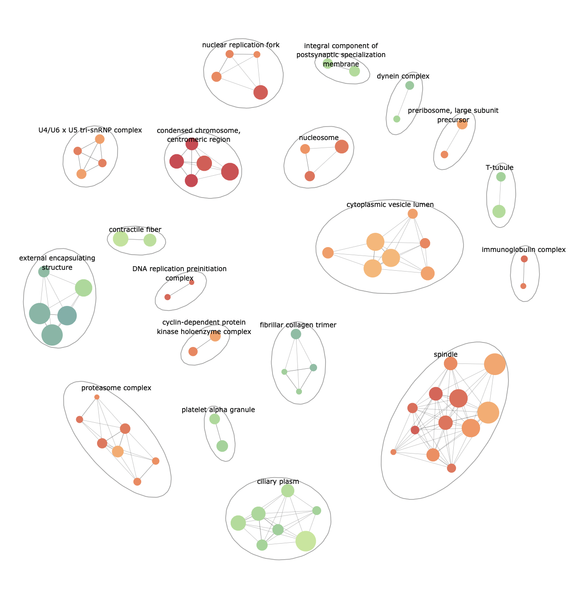

# pathExplore - an R package for high level GSEA exploration



## Installation

### Install latest stable version

```R
install.packages("devtools")
install.packages("ggrepel")
devtools::install_github('ievaKer/pathExplore')
```

### Install latest beta version

```R
devtools::install_github('ievaKer/pathExplore@development')
```

### Run an example

```R
devtools::install_git('https://git.bioconductor.org/packages/clusterProfiler')
install.packages("BiocManager")
BiocManager::install("org.Hs.eg.db")
devtools::install_git("https://git.bioconductor.org/packages/DOSE")
```

```R
library(pathExplore)
library(clusterProfiler)
library(org.Hs.eg.db)
library(DOSE)
data(geneList)

enrich <- gseGO(geneList, OrgDb = org.Hs.eg.db, ont = 'CC')
p <- enrichmentNetwork(enrich@result, drawEllipses = TRUE, fontSize = 2.5)

p
```

### Plotly integration

To create interactive plots, use plotly:

```R
library(plotly)

ggplotly(p, tooltip=c('ID', 'Cluster', 'Cluster size'))
```

You may find example plots in __results__ directory of this repository.
