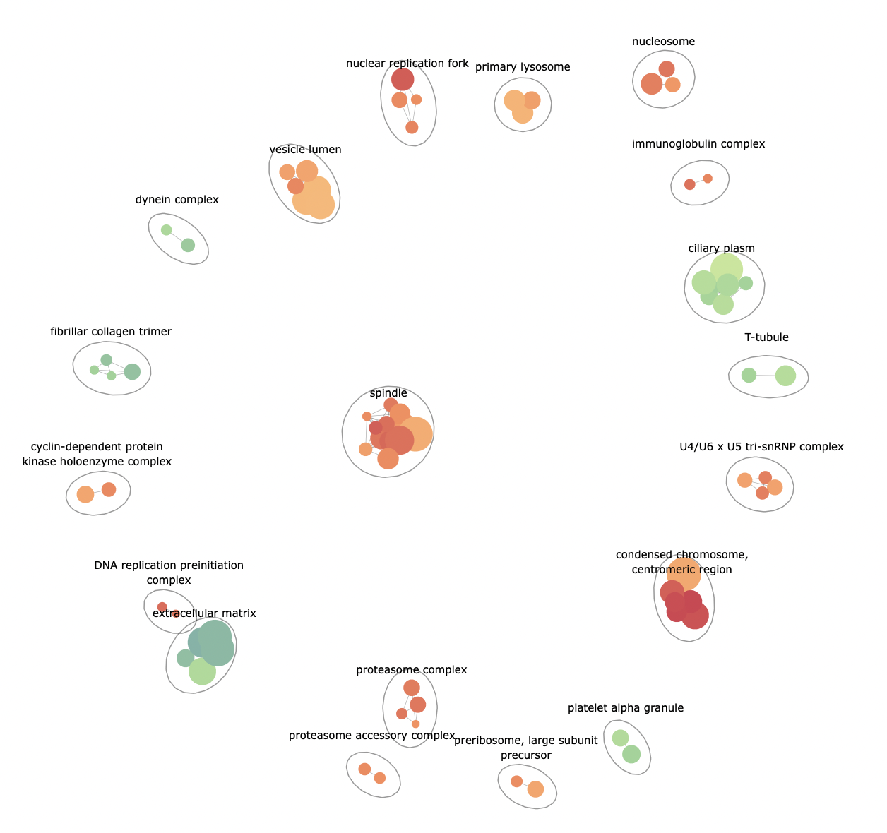

# pathExplore - an R package for high level GSEA exploration



## Installation

```R
library(devtools)
install_github('ievaKer/pathExplore')
```

### Run an example

```R
library(pathExplore)
library(clusterProfiler)
library(org.Hs.eg.db)
library(DOSE)
data(geneList)

enrich <- gseGO(geneList, OrgDb = org.Hs.eg.db, ont = 'CC')
enrichmentNetwork(enrich@result)
```
